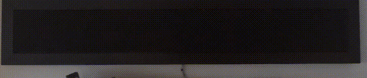

# Flip Dot Sign

This is a simple personal project -- I wanted to create a trainstation-style flip sign that could display:

- Countdowns to birthdays and holidays
- When the next bus is coming
- Countdowns to events from Google Calendar
- Weather forecasts
- Various cute text messages (song lyrics)
- Art by my kids (via images in Google Drive)

As they say, a .gif is worth a thousand words.  `run_demo.py` causes the sign to do this:



# Background

This project was my original motivation for learning to code / learning python, starting in 2015.  Creating the initial version of the sign was a fantastic introduction into the world of coding and APIs.

By 2022, my coding abilities had grown substantially since the sign was completed.  While I had new integration ideas, the `hello_world`-level code of the sign was a major limiting factor to any kind of new features.  A ground-up rewrite was in order.  Just as the initial sign was an opportunity to learn python, so the rewrite was a great way to take the next step and learn about package organization, logging, test-driven development, and mocking.

The flip sign has been a great playground for me, and I hope it will remain so for future steps forward in coding.

# Construction / Hardware

The display is made up of 18 sub-displays all made by [AlfaZeta in Poland](https://flipdots.com/), with a total resolution of 21 x 168.  The pixels are physical - yellow on one side, black on the other.  They change color by flipping magnetically from one side to the other.

The main controller is a [Raspberry Pi](https://www.raspberrypi.com) with an RS485 hat similar to [this one](https://thepihut.com/products/rs422-rs485-serial-hat).  The displays are connected to the RPi in a daisy-chain using crossover RJ11 cables.

The displays are mounted to a wooden lattice, which is attached to the wall using a [french cleat](https://en.wikipedia.org/wiki/French_cleat).

# Software / Interfaces

Code for the sign is written 100% in python.  The weather dashboard required custom weather icons and text stubs (made using [Procreate](https://procreate.com)), since no icons and text were available at a small enough size.

The two fonts in use are [Press Start 2P](https://www.dafont.com/press-start-2p.font) and a version of [DatDot](https://ggbot.itch.io/datdot-font) customized for Portuguese language support.

The sign talks to most Google services using the [google_api_python_client](https://github.com/googleapis/google-api-python-client) library.  The exception is the Google Geocoding service, which is accessed directly through the web API.  Communication with Accuweather is also through the web API.

# Installation & Usage


## Install

Clone the repo:
```commandline
git clone https://github.com/chapman-mcd/Flip-Sign
```

## Prerequisites/Dependencies

On raspberry pi, Pillow is missing some key outside-python dependencies.  To install:
```commandline
sudo apt-get install libjpeg-dev libtiff-dev
```


Now (after creating a virtual environment using your favorite environment manager) install dependencies using `requirements.txt`.
```commandline
conda create -n flip-sign
conda activate flip-sign
python -m pip install -r requirements.txt
```


## Batteries Not Included

A [Google Client Secret for OAuth2.0](https://support.google.com/cloud/answer/6158849) is required, with user-authorized access to the Calendar, Sheets and Drive APIs.  Also required are keys for [Google's Geocoding API](https://support.google.com/cloud/answer/6158849) and the [AccuWeather API](https://developer.accuweather.com).

These keys are expected in single-line files in `/flip_sign/assets/keys` and should be linked in by updating the `flip_sign.assets` module with the appropriate filenames.

Finally, the sign initially extracts messages from a Google Sheet.  The `sheet_id` for that sheet needs to be provided to `flip_sign.assets` as well.  The sheet ID for any Google Sheet can be extracted from the URL.

## Run

```commandline
python run_sign.py
```